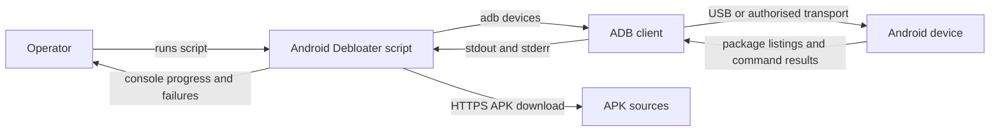
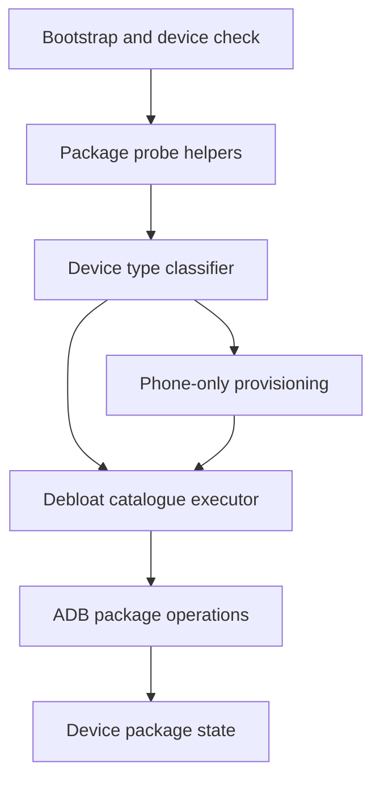
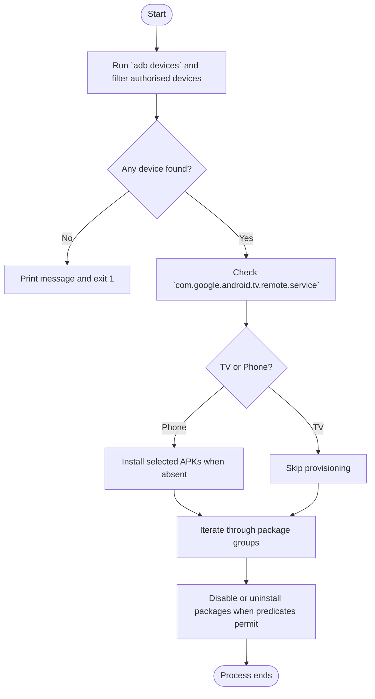
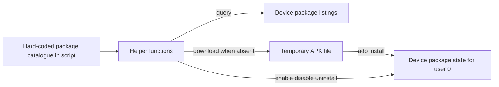
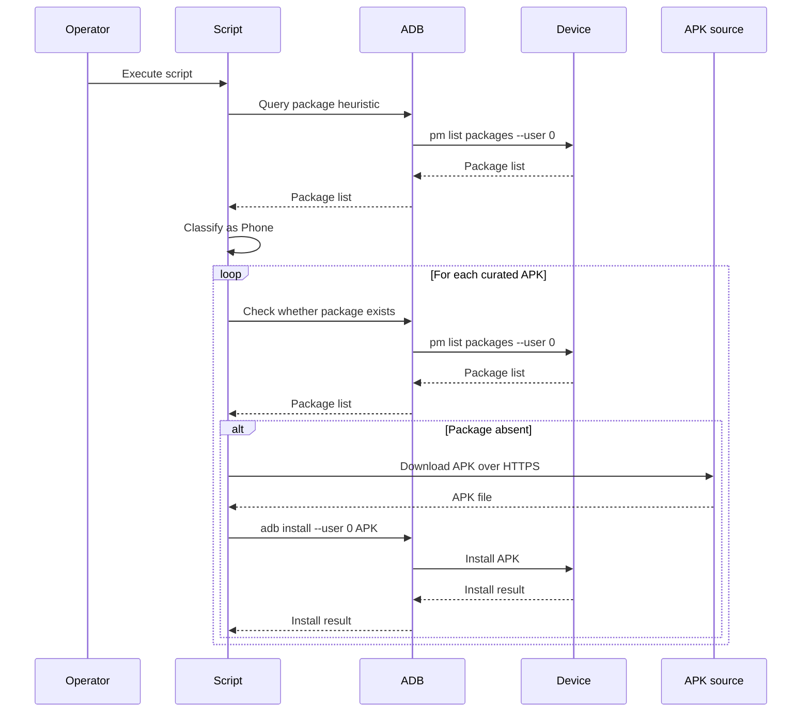
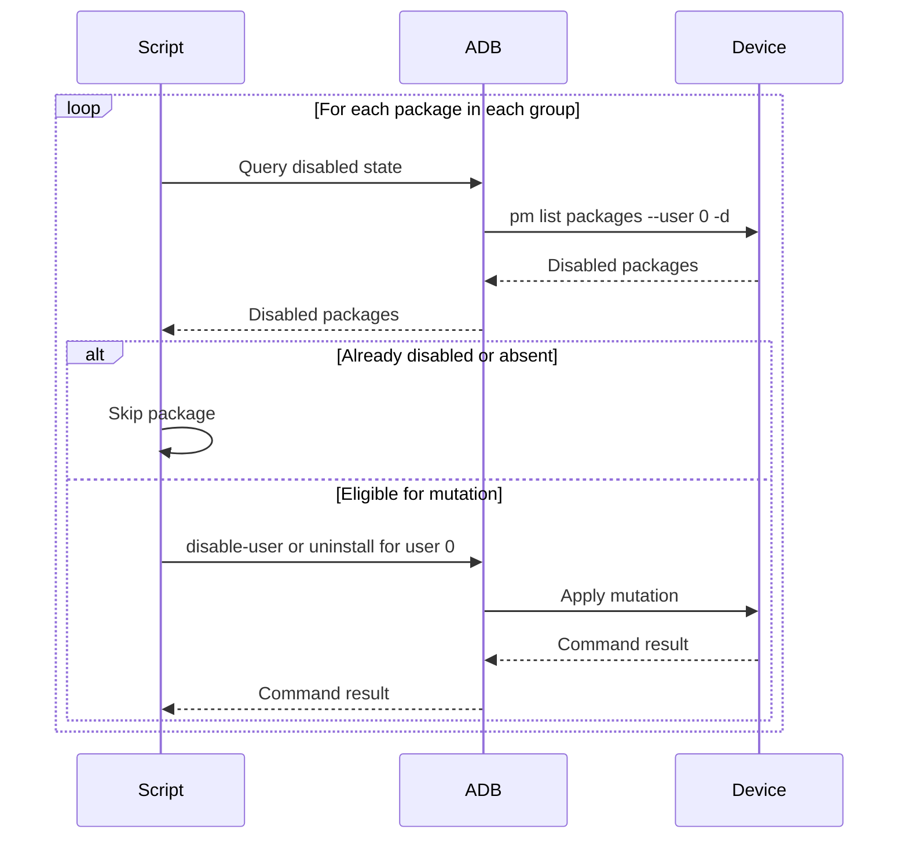
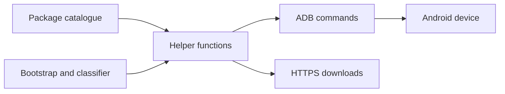

# Android Debloater Architecture

This document describes the current architecture of Android Debloater. Its scope is the single-process Bash script in this repository, the host-side tooling it composes, and the Android package-management boundary it modifies on connected devices.

## 📑 Table of Contents

- [Purpose](#purpose)
- [System Context](#system-context)
- [Architectural Style](#architectural-style)
- [Runtime Flow](#runtime-flow)
- [Components](#components)
- [Data Architecture](#data-architecture)
- [Interfaces and Integrations](#interfaces-and-integrations)
- [Key Flows](#key-flows)
  - [Phone Provisioning Flow](#phone-provisioning-flow)
  - [Package Deactivation Flow](#package-deactivation-flow)
- [Cross-Cutting Concerns](#cross-cutting-concerns)
  - [Security and Privacy](#security-and-privacy)
  - [Error Handling](#error-handling)
  - [Observability](#observability)
- [Dependency Direction and Rules](#dependency-direction-and-rules)
- [External Dependencies](#external-dependencies)
- [Deployment and Operations](#deployment-and-operations)
- [Compatibility Contracts](#compatibility-contracts)
- [Testing and Verification](#testing-and-verification)
- [Design Constraints](#design-constraints)
- [Architecture Decisions](#architecture-decisions)
- [Source Map](#source-map)
- [Related Documentation](#related-documentation)

## 🎯 Purpose

Android Debloater automates a curated Android debloating procedure through one Bash entry point, `android-debloater.sh`. The script detects an attached device through ADB, classifies it as a phone or TV through an installed-package heuristic, optionally provisions alternative applications for phones, and then executes a long sequential package deactivation pass with a smaller explicit uninstall subset.

This document is intended for contributors who need to understand where device state is read, where it is mutated, which external contracts the script depends upon, and which invariants must remain stable when the package catalogue or runtime behaviour changes.

## 🌐 System Context

The repository owns only the host-side orchestration script. It does not own the Android device, the Android package manager, or the upstream APK distribution endpoints. Trust is split between the local operator host, the ADB transport, and the connected Android device that authorises debugging access.



The principal external boundaries are:
- **Operator host:** Invokes the script and supplies the local Bash, `adb`, and `wget` executables.
- **ADB client:** Carries all device discovery, package inspection, enable, disable, uninstall, and install commands.
- **Android device:** Owns the package catalogue and the persistent package-enabled state for user `0` that the script mutates.
- **APK sources:** Provide optional phone-only application binaries over HTTPS for Aurora Store, F-Droid, Fossify applications, and Breezy Weather.

## 🏗️ Architectural Style

The implemented style is a procedural command-line batch pipeline in a single shell script. Logic is organised into a small set of helper functions for package-state probes and package mutations, followed by a declarative-looking sequence of package groups that drive those helpers.

This style keeps the system easy to run and easy to extend by appending package identifiers, but it also centralises orchestration, couples behaviour tightly to ADB command semantics, and leaves failure handling largely to the invoked command-line tools.



The principal architecture boundaries are:
- **Bootstrap:** Verifies that at least one ADB device is visible before any mutation is attempted.
- **Package helpers:** Encapsulate installed, disabled, enable, disable, install, uninstall, and reinstall operations behind Bash functions.
- **Classification and provisioning:** Applies phone-only APK installation before the general debloat pass.
- **Debloat catalogue:** Encodes the curated package identifiers and operation choice in an ordered, sequential list.

## 🔄 Runtime Flow



The principal runtime sequence is:
1. The script enumerates authorised ADB devices and aborts immediately when none are found.
2. It probes one package name to classify the connected device as `TV` or `Phone`.
3. For phones, it downloads and installs a small alternative-application set when those packages are absent.
4. It executes the curated debloat catalogue in source order, calling helper functions that skip already-disabled or absent packages.
5. The process terminates when the final package group completes; there is no explicit summary, rollback, or dry-run phase.

## 🧩 Components

| Component | Responsibility | Principal Dependencies | Lifetime or Ownership |
|-----------|----------------|------------------------|-----------------------|
| `Bootstrap` | Detect available ADB devices and abort when none are available | `adb`, `grep` | Runs once per invocation inside `android-debloater.sh` |
| `Package Probe Helpers` | Determine whether a package is installed or disabled for user `0` | `adb shell pm list packages`, `sed`, `grep` | Stateless shell functions reused throughout the invocation |
| `Package Mutation Helpers` | Enable, disable, uninstall, reinstall, or host-install packages | `adb shell pm`, `adb install`, `wget`, `rm` | Stateless shell functions reused throughout the invocation |
| `Device Classifier` | Distinguish `Phone` from `TV` through a package heuristic | `is_android_package_installed` | Runs once per invocation |
| `Provisioning Stage` | Install alternative APKs for phones when missing | `install_android_package`, HTTPS endpoints | Conditional stage owned by the script |
| `Debloat Catalogue Executor` | Apply the curated package-operation list in source order | Package helper functions, hard-coded package identifiers | Dominant runtime stage owned by the script |

## 💾 Data Architecture

The script does not maintain a repository-side database or long-lived configuration store. Its architecture instead depends on transient host-side data, hard-coded package catalogues, and persistent device-side package state owned by Android.



| Data or Store | Owner | Representation and Storage | Lifecycle or Consistency |
|---------------|-------|----------------------------|--------------------------|
| `Curated package catalogue` | Repository script | Hard-coded string literals in `android-debloater.sh` | Revised only through source changes; source order defines execution order |
| `Connected device list` | `adb` | Command output from `adb devices` on the host | Evaluated once at startup; no later refresh |
| `Device package listings` | Android package manager | Command output from `adb shell pm list packages` and `-d` | Queried repeatedly; reflects live device state at each call |
| `Temporary APK file` | Host script | `${PACKAGE_NAME}.apk` in the current working directory | Created only for phone provisioning, then removed after `adb install` is attempted |
| `Package enabled and installed state` | Android device | Persistent Android package-manager state for user `0` | Mutated sequentially by `pm disable-user`, `pm uninstall`, `pm enable`, or `pm install-existing` |

## 🔌 Interfaces and Integrations

| Interface or Integration | Direction | Contract | Owner | Failure Semantics |
|--------------------------|-----------|----------|-------|-------------------|
| `adb devices` | Outbound | ADB device enumeration text output | `Bootstrap` | No-device detection terminates the script with exit code `1` |
| `adb shell pm list packages` | Outbound | Android package-manager listing for user `0` | `Package Probe Helpers` | Probe helpers return success or failure to gate later mutations |
| `adb shell pm enable` | Outbound | Android package enable command for user `0` | `Package Mutation Helpers` | Command errors are emitted by `adb`; the script does not retry |
| `adb shell pm disable-user` | Outbound | Android package disable command for user `0` | `Package Mutation Helpers` | Command errors are emitted by `adb`; the script continues to subsequent work |
| `adb shell pm uninstall` | Outbound | Android package uninstall command for user `0` | `Package Mutation Helpers` | Command errors are emitted by `adb`; there is no rollback |
| `adb shell pm install-existing` | Outbound | Android system-package restoration for user `0` | `Package Mutation Helpers` | Available only when the package remains in the device image |
| `adb install --user 0` | Outbound | APK installation from a host file | `Provisioning Stage` | Installation failure surfaces through command output; the script still removes the temporary file |
| `wget --continue URL -O FILE` | Outbound | HTTPS file download into a named APK path | `Provisioning Stage` | No explicit checksum or retry policy is implemented in the script |

## 🔀 Key Flows

### Phone Provisioning Flow



This flow is gated entirely by the device-type heuristic. Provisioning occurs only for devices classified as phones, and calling or messaging alternatives are installed only when `com.android.stk` is present, which the script uses as its SIM-support heuristic. Provisioning is opportunistic rather than transactional: each package is checked and handled independently, and a failure in one installation does not produce a coordinated rollback of earlier installations.

### Package Deactivation Flow



The deactivation pass is ordered, synchronous, and best-effort. Each helper call re-evaluates current device state rather than relying on an in-memory cache, which improves idempotence at the cost of repeated ADB round-trips. The script primarily disables packages and uses uninstall operations only for a smaller explicit subset, preserving the repository’s conservative recovery posture.

## 🧵 Cross-Cutting Concerns

### Security and Privacy

The script operates across a trust boundary from the operator host into an ADB-authorised Android device. It requires USB debugging or an equivalent authorised ADB transport before it can mutate package state. The repository contains no secret material and does not define a credential source. Device package listings are processed in memory and emitted only indirectly through subordinate command output; the script does not persist device inventories to a repository-owned store.

Phone provisioning downloads APKs directly from hard-coded HTTPS URLs. The implementation does not perform checksum verification, signature validation beyond what Android installation enforces, or host-side provenance checks. From an architectural perspective, the safety model therefore depends upon trusted upstream distribution endpoints and the operator’s willingness to grant ADB-level control to the host.

### Error Handling

The only explicit process-level guard is the initial no-device check, which prints a message and exits with status `1`. Subsequent failures are handled implicitly by command exit codes and console output from `adb`, `wget`, or `rm`. The script does not enable `set -e`, does not aggregate failures, does not retry transient faults, and does not roll back prior package mutations when a later command fails.

This makes the runtime semantics largely best-effort after startup. Contributors should treat any new mutation step as independent work that may fail while the remainder of the catalogue continues to execute.

### Observability

Observability is limited to human-readable console messages produced by helper functions and the direct stdout or stderr of subordinate tools. There are no structured logs, metrics, traces, or final reconciliation reports. Progress is visible only as the script announces package operations and as ADB reports command results.

## 🧭 Dependency Direction and Rules

The dependency direction is intentionally simple: the root script owns orchestration, helper functions own command construction, and only those helpers cross into ADB or network boundaries. The package catalogue depends upon helper functions, while helper functions depend upon external executables rather than the reverse.



The principal dependency rules are:
- The curated package catalogue should invoke package helper functions rather than constructing ad hoc ADB commands inline for each entry.
- Device classification should remain a probe-driven decision owned by the script, not by individual package groups.
- Host-side provisioning should remain conditional and should not become a prerequisite for the general disable pass.
- The script is coupled to ADB and Android package-manager command semantics; replacing those boundaries would require helper-layer changes rather than catalogue-only edits.
- The current design does not support separate per-device orchestration layers, and package groups should not assume an independent target-selection mechanism that is not implemented.

## 📦 External Dependencies

| Dependency | Responsibility | Integration Boundary | Architectural Consequence |
|------------|----------------|----------------------|---------------------------|
| `bash` | Hosts the entry point, functions, control flow, and process composition | Entire script | The repository is a shell-first automation project rather than a compiled application |
| `adb` | Device discovery, package inspection, package mutation, and APK installation | Bootstrap, probes, and mutation helpers | Runtime correctness depends heavily upon ADB availability and its current command-line contract |
| `wget` | Retrieves optional APK payloads for phone provisioning | Provisioning stage | Network availability and remote asset continuity affect provisioning success |
| `Android package manager` | Owns the package listings and user-`0` mutation semantics | All `adb shell pm ...` calls | Android version and OEM differences affect which packages exist and how safe each mutation is |
| `HTTPS APK providers` | Distribute the alternative application binaries | Provisioning stage | Hard-coded remote URLs create an external continuity and trust dependency |

## 🚀 Deployment and Operations

The deployment unit is one repository script executed from a local shell on an operator-controlled host. There is no daemon, service mesh, scheduler, or remote control plane. Persistent state is owned by the Android device, while the host ordinarily retains only the repository checkout and short-lived APK files created during provisioning.

| Concern | Current Design | Architectural Consequence |
|---------|----------------|---------------------------|
| Process topology | One foreground Bash process | The operator sees progress directly and interruption simply terminates the current run |
| Target device selection | Startup accepts any visible authorised ADB device, but later commands do not pass `-s` | The script effectively assumes one active target device or an ADB context that resolves unambiguously |
| Host filesystem use | Temporary APKs are written into the current working directory | The working directory must be writable during phone provisioning |
| Network use | Only provisioning performs network downloads | TV-only runs and phone runs with all alternatives already installed do not require download traffic |
| Persistent state | Device package state is the only material persistent state modified by the script | Recovery depends on Android package-manager operations rather than repository-owned snapshots |
| Scaling | Sequential, single-device orchestration | There is no batching, parallel execution, or fleet-management abstraction |

## 🛡️ Compatibility Contracts

| Contract | Owner | Invariant | Verification | Change Policy |
|----------|-------|-----------|--------------|---------------|
| `Android package identifiers` | Debloat catalogue | Each package string must match the package-manager identifier expected on target devices | Manual verification on representative devices and inspection of `pm list packages` output | Amend conservatively; OEM- or ROM-specific additions should not break unrelated devices |
| `User 0 mutation scope` | Package helper functions | All package mutations target `--user 0` | Manual command inspection and runtime validation on a device | Preserve unless the project intentionally broadens its target model |
| `TV detection heuristic` | Device classifier | `com.google.android.tv.remote.service` implies `TV`; absence implies `Phone` | Manual validation on representative phone and TV devices | Alter only with evidence that a different heuristic is more reliable |
| `Disable-over-uninstall default` | Repository policy embodied in code and README | General debloating prefers disable operations, with uninstall reserved for explicit exceptions | Source review and manual execution | Preserve the conservative default unless project policy changes deliberately |

## ✅ Testing and Verification

The repository currently contains no automated test suite, no shell lint configuration, and no fixture-based device simulation. Architecture-sensitive verification is therefore split between syntax checking and manual execution against a connected Android device.

Execute the principal automated verification with:

```bash
bash -n ./android-debloater.sh
```

Manual verification remains material for:
- validating that `adb devices` reports exactly the intended authorised target;
- confirming phone-versus-TV classification on representative devices;
- confirming that key disable and uninstall operations behave as expected on the target ROM; and
- validating recovery commands such as `pm enable` or `pm install-existing` for packages altered during a run.

## ⚠️ Design Constraints

- **Single-script ownership:** All orchestration, policy, and catalogue data reside in one Bash file, which keeps editing simple but concentrates change risk in a single source unit.
- **ADB contract dependence:** The runtime depends upon current `adb` and Android package-manager command semantics, including `pm list packages`, `pm disable-user`, `pm uninstall`, and `adb install`.
- **Single-target assumption:** The implementation does not thread a device serial through subsequent commands, so multiple attached devices create ambiguity.
- **Best-effort execution:** After startup, the script does not enforce transactional behaviour, rollback, retries, or a failure summary.
- **Heuristic classification:** Device type and SIM capability are inferred from package presence, not from a formal Android device-capability API.
- **Curated static catalogue:** Package groups are hard-coded rather than discovered dynamically, so package relevance varies across OEMs, ROMs, and Android versions.
- **Remote asset fragility:** Provisioning URLs are embedded directly in source and can become stale independently of repository changes.

## 📝 Architecture Decisions

| Decision | Rationale | Consequence | Record |
|----------|-----------|-------------|--------|
| Prefer disabling to uninstalling for most packages | The script header comments and README both state that disabling is safer to reverse and safer for OTA updates | The catalogue uses disable operations for the majority of packages and keeps uninstalls explicit and limited | Documented here |
| Use package-presence heuristics for device classification | The repository has no richer device-discovery layer than ADB package inspection | Classification remains lightweight and dependency-free, but accuracy depends upon the continued relevance of selected package markers | Documented here |
| Provision alternative applications only on phones | The script installs Aurora Store, F-Droid, Fossify applications, and Breezy Weather only when the device is classified as a phone | TV runs avoid unrelated host downloads and package installs | Documented here |

## 🗺️ Source Map

| Area | Path |
|------|------|
| Host-side orchestration script | `android-debloater.sh` |
| User-facing usage and recovery guidance | `README.md` |
| Repository architecture description | `ARCHITECTURE.md` |

## 📚 Related Documentation

- [README.md](README.md) describes usage, recovery commands, known limitations, and development setup.
- [LICENSE](LICENSE) defines the repository licence terms.